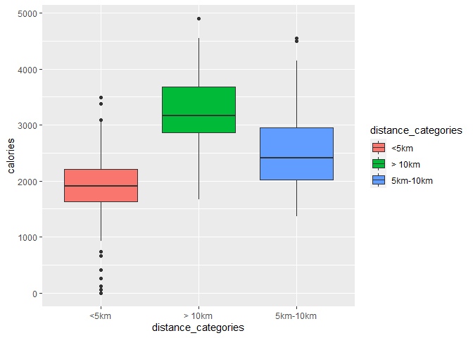
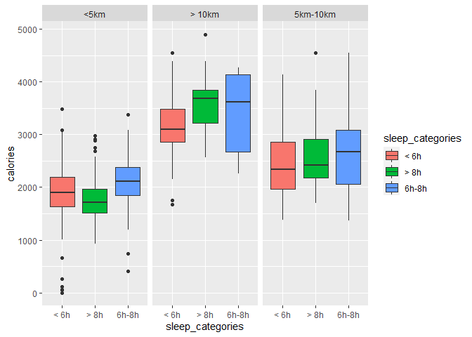

Итоговый проект для Google Data Analytics Profefessional Certificate
================
Сергей Векленко
07.09.2021

## Устанавливаем и загружаем базовые пакеты и библиотеки.

``` r
install.packages('tidyverse',repos = "http://cran.us.r-project.org")
```

    ## Устанавливаю пакет в 'C:/Users/svekl/Documents/R/win-library/4.1'
    ## (потому что 'lib' не определено)

    ## package 'tidyverse' successfully unpacked and MD5 sums checked
    ## 
    ## The downloaded binary packages are in
    ##  C:\Users\svekl\AppData\Local\Temp\Rtmpo3C4gD\downloaded_packages

``` r
library(tidyverse)
```

    ## -- Attaching packages --------------------------------------- tidyverse 1.3.1 --

    ## v ggplot2 3.3.5     v purrr   0.3.4
    ## v tibble  3.1.4     v dplyr   1.0.7
    ## v tidyr   1.1.3     v stringr 1.4.0
    ## v readr   2.0.1     v forcats 0.5.1

    ## -- Conflicts ------------------------------------------ tidyverse_conflicts() --
    ## x dplyr::filter() masks stats::filter()
    ## x dplyr::lag()    masks stats::lag()

``` r
install.packages('janitor',repos = "http://cran.us.r-project.org")
```

    ## Устанавливаю пакет в 'C:/Users/svekl/Documents/R/win-library/4.1'
    ## (потому что 'lib' не определено)

    ## package 'janitor' successfully unpacked and MD5 sums checked
    ## 
    ## The downloaded binary packages are in
    ##  C:\Users\svekl\AppData\Local\Temp\Rtmpo3C4gD\downloaded_packages

``` r
library('janitor')
```

    ## 
    ## Присоединяю пакет: 'janitor'

    ## Следующие объекты скрыты от 'package:stats':
    ## 
    ##     chisq.test, fisher.test

``` r
install.packages('skimr',repos = "http://cran.us.r-project.org")
```

    ## Устанавливаю пакет в 'C:/Users/svekl/Documents/R/win-library/4.1'
    ## (потому что 'lib' не определено)

    ## package 'skimr' successfully unpacked and MD5 sums checked
    ## 
    ## The downloaded binary packages are in
    ##  C:\Users\svekl\AppData\Local\Temp\Rtmpo3C4gD\downloaded_packages

``` r
library('skimr')
install.packages('here',repos = "http://cran.us.r-project.org")
```

    ## Устанавливаю пакет в 'C:/Users/svekl/Documents/R/win-library/4.1'
    ## (потому что 'lib' не определено)

    ## package 'here' successfully unpacked and MD5 sums checked
    ## 
    ## The downloaded binary packages are in
    ##  C:\Users\svekl\AppData\Local\Temp\Rtmpo3C4gD\downloaded_packages

``` r
library('here')
```

    ## here() starts at C:/Users/svekl/Desktop/Работа/Fitabase Data 4.12.16-5.12.16

``` r
install.packages('dplyr',repos = "http://cran.us.r-project.org")
```

    ## Warning: пакет ''dplyr'' сейчас используется и не будет установлен

``` r
library('dplyr')
install.packages('lubridate',repos = "http://cran.us.r-project.org")
```

    ## Устанавливаю пакет в 'C:/Users/svekl/Documents/R/win-library/4.1'
    ## (потому что 'lib' не определено)

    ## package 'lubridate' successfully unpacked and MD5 sums checked

    ## Warning: cannot remove prior installation of package 'lubridate'

    ## Warning in file.copy(savedcopy, lib, recursive = TRUE):
    ## проблема с копированием C:\Users\svekl\Documents\R\win-
    ## library\4.1\00LOCK\lubridate\libs\x64\lubridate.dll в C:
    ## \Users\svekl\Documents\R\win-library\4.1\lubridate\libs\x64\lubridate.dll:
    ## Permission denied

    ## Warning: restored 'lubridate'

    ## 
    ## The downloaded binary packages are in
    ##  C:\Users\svekl\AppData\Local\Temp\Rtmpo3C4gD\downloaded_packages

``` r
library(lubridate)
```

    ## 
    ## Присоединяю пакет: 'lubridate'

    ## Следующие объекты скрыты от 'package:base':
    ## 
    ##     date, intersect, setdiff, union

``` r
install.packages('ggplot2',repos = "http://cran.us.r-project.org")
```

    ## Warning: пакет ''ggplot2'' сейчас используется и не будет установлен

``` r
library(ggplot2)
```

## Подключаем csv файлы.

Мы создаем дата фреймы для хранения наших данных и более удобного
использования в дальнейшем.

``` r
dailyActivity <- read_csv("dailyActivity_merged.csv")
```

    ## Rows: 940 Columns: 15

    ## -- Column specification --------------------------------------------------------
    ## Delimiter: ","
    ## chr  (1): ActivityDate
    ## dbl (14): Id, TotalSteps, TotalDistance, TrackerDistance, LoggedActivitiesDi...

    ## 
    ## i Use `spec()` to retrieve the full column specification for this data.
    ## i Specify the column types or set `show_col_types = FALSE` to quiet this message.

``` r
dailyCalories <- read_csv("dailyCalories_merged.csv")
```

    ## Rows: 940 Columns: 3

    ## -- Column specification --------------------------------------------------------
    ## Delimiter: ","
    ## chr (1): ActivityDay
    ## dbl (2): Id, Calories

    ## 
    ## i Use `spec()` to retrieve the full column specification for this data.
    ## i Specify the column types or set `show_col_types = FALSE` to quiet this message.

``` r
dailyIntensities <- read_csv("dailyIntensities_merged.csv")
```

    ## Rows: 940 Columns: 10

    ## -- Column specification --------------------------------------------------------
    ## Delimiter: ","
    ## chr (1): ActivityDay
    ## dbl (9): Id, SedentaryMinutes, LightlyActiveMinutes, FairlyActiveMinutes, Ve...

    ## 
    ## i Use `spec()` to retrieve the full column specification for this data.
    ## i Specify the column types or set `show_col_types = FALSE` to quiet this message.

``` r
dailySteps <- read_csv("dailySteps_merged.csv")
```

    ## Rows: 940 Columns: 3

    ## -- Column specification --------------------------------------------------------
    ## Delimiter: ","
    ## chr (1): ActivityDay
    ## dbl (2): Id, StepTotal

    ## 
    ## i Use `spec()` to retrieve the full column specification for this data.
    ## i Specify the column types or set `show_col_types = FALSE` to quiet this message.

``` r
heartrate_seconds <- read_csv("heartrate_seconds_merged.csv")
```

    ## Rows: 2483658 Columns: 3

    ## -- Column specification --------------------------------------------------------
    ## Delimiter: ","
    ## chr (1): Time
    ## dbl (2): Id, Value

    ## 
    ## i Use `spec()` to retrieve the full column specification for this data.
    ## i Specify the column types or set `show_col_types = FALSE` to quiet this message.

``` r
hourlyCalories <- read_csv("hourlyCalories_merged.csv")
```

    ## Rows: 22099 Columns: 3

    ## -- Column specification --------------------------------------------------------
    ## Delimiter: ","
    ## chr (1): ActivityHour
    ## dbl (2): Id, Calories

    ## 
    ## i Use `spec()` to retrieve the full column specification for this data.
    ## i Specify the column types or set `show_col_types = FALSE` to quiet this message.

``` r
hourlyIntensities <- read_csv("hourlyIntensities_merged.csv")
```

    ## Rows: 22099 Columns: 4

    ## -- Column specification --------------------------------------------------------
    ## Delimiter: ","
    ## chr (1): ActivityHour
    ## dbl (3): Id, TotalIntensity, AverageIntensity

    ## 
    ## i Use `spec()` to retrieve the full column specification for this data.
    ## i Specify the column types or set `show_col_types = FALSE` to quiet this message.

``` r
hourlySteps <- read_csv("hourlySteps_merged.csv")
```

    ## Rows: 22099 Columns: 3

    ## -- Column specification --------------------------------------------------------
    ## Delimiter: ","
    ## chr (1): ActivityHour
    ## dbl (2): Id, StepTotal

    ## 
    ## i Use `spec()` to retrieve the full column specification for this data.
    ## i Specify the column types or set `show_col_types = FALSE` to quiet this message.

``` r
minuteCaloriesNarrow <- read_csv("minuteCaloriesNarrow_merged.csv")
```

    ## Rows: 1325580 Columns: 3

    ## -- Column specification --------------------------------------------------------
    ## Delimiter: ","
    ## chr (1): ActivityMinute
    ## dbl (2): Id, Calories

    ## 
    ## i Use `spec()` to retrieve the full column specification for this data.
    ## i Specify the column types or set `show_col_types = FALSE` to quiet this message.

``` r
minuteCaloriesWide <- read_csv("minuteCaloriesWide_merged.csv")
```

    ## Rows: 21645 Columns: 62

    ## -- Column specification --------------------------------------------------------
    ## Delimiter: ","
    ## chr  (1): ActivityHour
    ## dbl (61): Id, Calories00, Calories01, Calories02, Calories03, Calories04, Ca...

    ## 
    ## i Use `spec()` to retrieve the full column specification for this data.
    ## i Specify the column types or set `show_col_types = FALSE` to quiet this message.

``` r
minuteMETsNarrow <- read_csv("minuteMETsNarrow_merged.csv")
```

    ## Rows: 1325580 Columns: 3

    ## -- Column specification --------------------------------------------------------
    ## Delimiter: ","
    ## chr (1): ActivityMinute
    ## dbl (2): Id, METs

    ## 
    ## i Use `spec()` to retrieve the full column specification for this data.
    ## i Specify the column types or set `show_col_types = FALSE` to quiet this message.

``` r
minuteSleep <- read_csv("minuteSleep_merged.csv")
```

    ## Rows: 188521 Columns: 4

    ## -- Column specification --------------------------------------------------------
    ## Delimiter: ","
    ## chr (1): date
    ## dbl (3): Id, value, logId

    ## 
    ## i Use `spec()` to retrieve the full column specification for this data.
    ## i Specify the column types or set `show_col_types = FALSE` to quiet this message.

``` r
minuteStepsNarrow <- read_csv("minuteStepsNarrow_merged.csv")
```

    ## Rows: 1325580 Columns: 3

    ## -- Column specification --------------------------------------------------------
    ## Delimiter: ","
    ## chr (1): ActivityMinute
    ## dbl (2): Id, Steps

    ## 
    ## i Use `spec()` to retrieve the full column specification for this data.
    ## i Specify the column types or set `show_col_types = FALSE` to quiet this message.

``` r
minuteStepsWide <- read_csv("minuteStepsWide_merged.csv")
```

    ## Rows: 21645 Columns: 62

    ## -- Column specification --------------------------------------------------------
    ## Delimiter: ","
    ## chr  (1): ActivityHour
    ## dbl (61): Id, Steps00, Steps01, Steps02, Steps03, Steps04, Steps05, Steps06,...

    ## 
    ## i Use `spec()` to retrieve the full column specification for this data.
    ## i Specify the column types or set `show_col_types = FALSE` to quiet this message.

``` r
sleepDay <- read_csv("sleepDay_merged.csv")
```

    ## Rows: 413 Columns: 5

    ## -- Column specification --------------------------------------------------------
    ## Delimiter: ","
    ## chr (1): SleepDay
    ## dbl (4): Id, TotalSleepRecords, TotalMinutesAsleep, TotalTimeInBed

    ## 
    ## i Use `spec()` to retrieve the full column specification for this data.
    ## i Specify the column types or set `show_col_types = FALSE` to quiet this message.

``` r
weightLogInfo <- read_csv("weightLogInfo_merged.csv")
```

    ## Rows: 67 Columns: 8

    ## -- Column specification --------------------------------------------------------
    ## Delimiter: ","
    ## chr (1): Date
    ## dbl (6): Id, WeightKg, WeightPounds, Fat, BMI, LogId
    ## lgl (1): IsManualReport

    ## 
    ## i Use `spec()` to retrieve the full column specification for this data.
    ## i Specify the column types or set `show_col_types = FALSE` to quiet this message.

## Подготовка данных.

Обратим внимание на дата фреймы с которыми мы планируем работать.

``` r
dailyActivity_merged_2 <- clean_names(dailyActivity)
```

    ## Warning in FUN(X[[i]], ...): строки, непредставимые в нативной кодировке, не
    ## могут быть перекодированы в UTF-8

    ## Warning in FUN(X[[i]], ...): не могу перевести '<U+00DF>' в исходную кодировку
    ## системы

    ## Warning in FUN(X[[i]], ...): не могу перевести '<U+00C6>' в исходную кодировку
    ## системы

    ## Warning in FUN(X[[i]], ...): не могу перевести '<U+00E6>' в исходную кодировку
    ## системы

``` r
sleepDay_merged_2 <- clean_names(sleepDay)
weightLogInfo_merged_2 <- clean_names(weightLogInfo)

View(dailyActivity_merged_2)
View(sleepDay_merged_2)
View(weightLogInfo_merged_2)
```

#### Работа с датами.

Дело в том, что dailyActivity в mdy формате даты, а weightLog и sleepDay
в mdy\_hms. И наша задача решить этот вопрос

``` r
dailyActivity_merged_2$activity_date <- as.Date(dailyActivity_merged_2$activity_date, "%m/%d/%Y")
weightLogInfo_merged_2$date <- parse_date_time(weightLogInfo_merged_2$date, orders = 'mdy HMS')
weightLogInfo_merged_2$date <- as.Date(weightLogInfo_merged_2$date, "%m/%d/%y %h:%m:%s")
```

    ## Warning in as.POSIXlt.POSIXct(x, tz = tz): unknown timezone '%m/%d/%y %h:%m:%s'

``` r
sleepDay_merged_2$sleep_day <- parse_date_time(sleepDay_merged_2$sleep_day, orders = 'mdy HMS')
sleepDay_merged_2$sleep_day <- as.Date(sleepDay_merged_2$sleep_day, "%m/%d/%y %h:%m:%s")
```

    ## Warning in as.POSIXlt.POSIXct(x, tz = tz): unknown timezone '%m/%d/%y %h:%m:%s'

``` r
View(sleepDay_merged_2)
View(weightLogInfo_merged_2)
View(dailyActivity_merged_2)

str(sleepDay_merged_2)
```

    ## spec_tbl_df [413 x 5] (S3: spec_tbl_df/tbl_df/tbl/data.frame)
    ##  $ id                  : num [1:413] 1.5e+09 1.5e+09 1.5e+09 1.5e+09 1.5e+09 ...
    ##  $ sleep_day           : Date[1:413], format: "2016-04-12" "2016-04-13" ...
    ##  $ total_sleep_records : num [1:413] 1 2 1 2 1 1 1 1 1 1 ...
    ##  $ total_minutes_asleep: num [1:413] 327 384 412 340 700 304 360 325 361 430 ...
    ##  $ total_time_in_bed   : num [1:413] 346 407 442 367 712 320 377 364 384 449 ...
    ##  - attr(*, "spec")=
    ##   .. cols(
    ##   ..   Id = col_double(),
    ##   ..   SleepDay = col_character(),
    ##   ..   TotalSleepRecords = col_double(),
    ##   ..   TotalMinutesAsleep = col_double(),
    ##   ..   TotalTimeInBed = col_double()
    ##   .. )
    ##  - attr(*, "problems")=<externalptr>

``` r
str(weightLogInfo_merged_2)
```

    ## spec_tbl_df [67 x 8] (S3: spec_tbl_df/tbl_df/tbl/data.frame)
    ##  $ id              : num [1:67] 1.50e+09 1.50e+09 1.93e+09 2.87e+09 2.87e+09 ...
    ##  $ date            : Date[1:67], format: "2016-05-02" "2016-05-03" ...
    ##  $ weight_kg       : num [1:67] 52.6 52.6 133.5 56.7 57.3 ...
    ##  $ weight_pounds   : num [1:67] 116 116 294 125 126 ...
    ##  $ fat             : num [1:67] 22 NA NA NA NA 25 NA NA NA NA ...
    ##  $ bmi             : num [1:67] 22.6 22.6 47.5 21.5 21.7 ...
    ##  $ is_manual_report: logi [1:67] TRUE TRUE FALSE TRUE TRUE TRUE ...
    ##  $ log_id          : num [1:67] 1.46e+12 1.46e+12 1.46e+12 1.46e+12 1.46e+12 ...
    ##  - attr(*, "spec")=
    ##   .. cols(
    ##   ..   Id = col_double(),
    ##   ..   Date = col_character(),
    ##   ..   WeightKg = col_double(),
    ##   ..   WeightPounds = col_double(),
    ##   ..   Fat = col_double(),
    ##   ..   BMI = col_double(),
    ##   ..   IsManualReport = col_logical(),
    ##   ..   LogId = col_double()
    ##   .. )
    ##  - attr(*, "problems")=<externalptr>

``` r
str(dailyActivity_merged_2)
```

    ## spec_tbl_df [940 x 15] (S3: spec_tbl_df/tbl_df/tbl/data.frame)
    ##  $ id                        : num [1:940] 1.5e+09 1.5e+09 1.5e+09 1.5e+09 1.5e+09 ...
    ##  $ activity_date             : Date[1:940], format: "2016-04-12" "2016-04-13" ...
    ##  $ total_steps               : num [1:940] 13162 10735 10460 9762 12669 ...
    ##  $ total_distance            : num [1:940] 8.5 6.97 6.74 6.28 8.16 ...
    ##  $ tracker_distance          : num [1:940] 8.5 6.97 6.74 6.28 8.16 ...
    ##  $ logged_activities_distance: num [1:940] 0 0 0 0 0 0 0 0 0 0 ...
    ##  $ very_active_distance      : num [1:940] 1.88 1.57 2.44 2.14 2.71 ...
    ##  $ moderately_active_distance: num [1:940] 0.55 0.69 0.4 1.26 0.41 ...
    ##  $ light_active_distance     : num [1:940] 6.06 4.71 3.91 2.83 5.04 ...
    ##  $ sedentary_active_distance : num [1:940] 0 0 0 0 0 0 0 0 0 0 ...
    ##  $ very_active_minutes       : num [1:940] 25 21 30 29 36 38 42 50 28 19 ...
    ##  $ fairly_active_minutes     : num [1:940] 13 19 11 34 10 20 16 31 12 8 ...
    ##  $ lightly_active_minutes    : num [1:940] 328 217 181 209 221 164 233 264 205 211 ...
    ##  $ sedentary_minutes         : num [1:940] 728 776 1218 726 773 ...
    ##  $ calories                  : num [1:940] 1985 1797 1776 1745 1863 ...
    ##  - attr(*, "spec")=
    ##   .. cols(
    ##   ..   Id = col_double(),
    ##   ..   ActivityDate = col_character(),
    ##   ..   TotalSteps = col_double(),
    ##   ..   TotalDistance = col_double(),
    ##   ..   TrackerDistance = col_double(),
    ##   ..   LoggedActivitiesDistance = col_double(),
    ##   ..   VeryActiveDistance = col_double(),
    ##   ..   ModeratelyActiveDistance = col_double(),
    ##   ..   LightActiveDistance = col_double(),
    ##   ..   SedentaryActiveDistance = col_double(),
    ##   ..   VeryActiveMinutes = col_double(),
    ##   ..   FairlyActiveMinutes = col_double(),
    ##   ..   LightlyActiveMinutes = col_double(),
    ##   ..   SedentaryMinutes = col_double(),
    ##   ..   Calories = col_double()
    ##   .. )
    ##  - attr(*, "problems")=<externalptr>

#### Объединение дата сетов.

В данном случае при использовании merge мы пользуемся left join. NA все
равно будут появляться, но они будут заменены 0.

``` r
daily_activity_sleep <- merge(x= dailyActivity_merged_2, y= sleepDay_merged_2,
                              by.x = c("id", "activity_date"), by.y = c("id", "sleep_day"), all.x = TRUE)
daily_activity_sleep [is.na(daily_activity_sleep)] <- 0
View(daily_activity_sleep)
```

## Анализ данных.

#### Создадим категории.

1.  Сон &lt;6ч, 6-8ч, &gt;8ч
2.  Калории &lt;1500, 1500-2500, &gt;2500
3.  Пройденное расстояниие &lt;5км, 5-10км, &gt;10км

``` r
daily_activity_sleep <- daily_activity_sleep %>% 
  mutate(sleep_categories = case_when(
    total_minutes_asleep >360 & total_minutes_asleep <= 480 ~ "6h-8h",
    total_minutes_asleep > 480 ~ "> 8h",
    TRUE ~ "< 6h"
  )) %>% 
  mutate(calorie_categories = case_when(
    calories > 1500 & calories <= 2500 ~ "1.5k-2.5k",
    calories > 2500 ~ "> 2.5k",
    TRUE ~ "< 1.5k"
  )) %>% 
  mutate(distance_categories = case_when(
    total_distance > 5 & total_distance <= 10 ~ "5km-10km",
    total_distance > 10 ~ "> 10km",
    TRUE ~ "<5km"
  ))

View(daily_activity_sleep)
```

#### Создадим визуализации.

Для начала рассмотрим зависимость сожженных калорий от пройденного
расстояния.

``` r
ggplot(data= daily_activity_sleep) +
  geom_boxplot(mapping= aes(x=distance_categories, y= calories, fill= distance_categories))
```

<!-- -->

Далее рассмотрим зависимость между сном и сожженными калориями.

``` r
ggplot(data= daily_activity_sleep) +
  geom_boxplot(mapping= aes(x=sleep_categories, y= calories, fill= sleep_categories))+facet_wrap("distance_categories")
```

<!-- -->

#### Итоги анализа.

Корреляция между расстоянием и калориями.

1.  На графике отчетливо видно прямую зависимость сожженных калорий от
    пройденной дистанции, больше прошел - больше сжег.
2.  В среднем люди, которые проходят менее 5км сжигают около 1800
    калорий.
3.  В среднем люди, которые проходят 5-10км сжигают около 2400 калорий.
4.  В среднем люди, которые проходят более 10км сжигают около 3100
    калорий.

Корреляция между сном и затратами каллорий.

1.  В серднем люди которые спят менее 6 и более 8 часов в день сжигают
    меньше калорий, чем те, кто спят по 6-8 часов при сравнительно
    одинаковой нагрузке.

## Бизнес рекомендации.

Основываясь на выводах приведенных выше привожу свои рекомендации для
компании Bellabeat: 1. В исследовании очевидна корреляция между сном и
сжиганием калорий. Можно приводить в пример важность отслеживания
качества и продолжительности сна для снижения веса. 2. Так же может быть
разработана и использована маркетинговая стратегия для донесения
пользователям информации о важности хорошего сна, как его достичь и как
Bellabeat и продукция компании может в этом помочь. 3. Одно из главных
достоинств использования умных устройст - мотивировать пользователей
вести более здоровый образ жизни. Можно разработать функцию сравнения
сверстников для мотивации пользователей вести более здоровый образ
жизни. 4. Так как данные использованные в данном исследовании не
являются достоверными в полной мере - все предложения, приведенные выше
требуют дополнительного рассмотрения.
